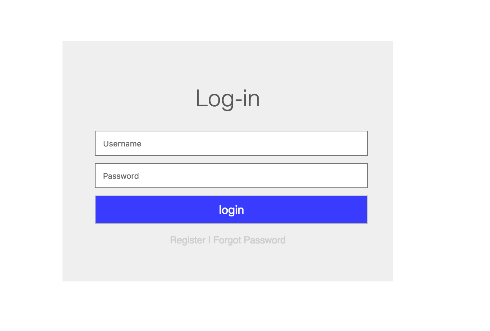
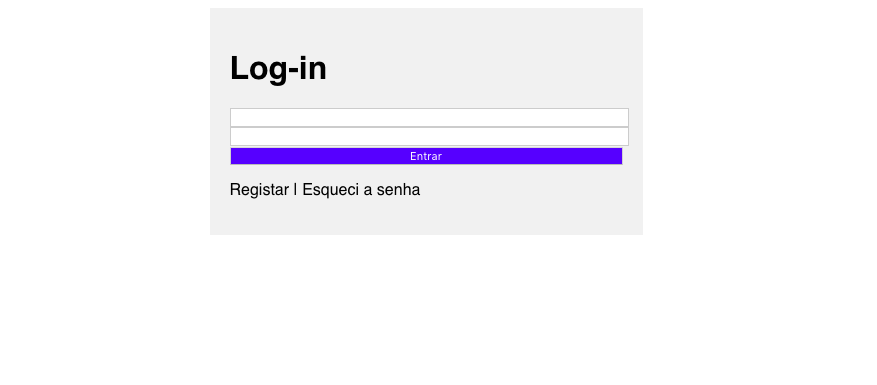

# Aula 1 Fábrica de Programador - T24

Data da aula: 09/02/2019

## Objetivo da Aula

O objetivo da aula foi criar a seguinte tela de login:



## Resumo da Aula

Nesta aula conhecemos a IDE Visual Studio Code, assim como as linguagens de marcação: HTML5 e CSS3.

> ATENÇÃO: HTML e CSS NÃO são consideradas linguagens de programação, e sim, linguagem de `marcação`. Isso se deve ao fato de que as duas linguagens são **interpretadas** pelo **browser** e não são **executadas**. Podemos dizer, via de regra, que uma linguagem para ser considerada linguagem de programação, deve ser possível **executá-la** de alguma maneira. Logo pelo fato de que o HTML e CSS não são executados e sim interpredatos, eles são considerados **Linguagens de Marcação**

Criamos uma pasta chamada `fabrica-t24` e a abrimos no VSCode (Visual Studio Code). Após isso criamos a pasta `aula1` dentro da pasta já aberta.

Depois das pastas, criamos o arquivo `login.html`. Foi explicado como o HTML funciona e suas `tags`. Lembrando que as `tags` HTML tem o seguinte formato:

```html
<tag atributo="valor">
```
Onde:

+ `tag` é o nome do elemento (ou nome da *tag*) (ex: body, head, h1, form, input, etc).
+ `atributo` é indica uma configuração comportamental que iremos fazer na `tag`.
+ E o `valor` que está entre as aspas representa do valor da configuração indicada no `atributo`. É importante lembrar que o VALOR de um abtributos de *tag* SEMPRE devem estrar entre aspas

Por exemplo, no seguinte código:
 
```html
<input type="password"
```
Temos o elemto (*tag*) sendo o `input` que representa um caixa de entrada, e o `type` sendo `"password"`. Lembra-se que o atributo de *tag* representa um comportamento? Pois bem, o atributo `type` do `input` diz qual é o tipo de dado permitido como entrada. É importante frisar que o funcionamento do atributo depende do elemento elemento que o possui. Por exemplo, o elemento `h1` não suporta o atributo `type`. O que aliás faz todo sentido, pois como eu poderia dizer qual é o "tipo" da "entrada" de um `h1` sendo que ele é um título, ou seja, não tem entrada.

Depois vimos como se uma página HTML com o próprio VSCode, utilizando o seu recurso de autocompletar (autocomplete). A estrutura do documento, por padrão, fica assim:

```html
<!DOCTYPE html>
<html lang="en">
<head>
    <meta charset="UTF-8">
    <meta name="viewport" content="width=device-width, initial-scale=1.0">
    <meta http-equiv="X-UA-Compatible" content="ie=edge">
    <title>Document</title>
</head>
<body>
    
</body>
</html>
```

Onde:
+ `DOCTYPE html` indica que este é um documento HTML5;
+ `html` indica o início e o fim do documento HTML;
+ `head` é a *tag* de cabeçalho do documento e indica o comportamento do mesmo;
+ `meta charset="UTF-8"` configura o *encoding* de caracteres da página, onde `UTF-8` é o padrão para reconhecimento dos carecteres especias e acentos em geral;
+ `meta name="viewport"` defique o tamanho da largura da tela deve ser o tamanho da tela do dispositivo, dessa forma independente de qual aparelho a página é acessada (desktop, notebook, tablet, smartphone, etc) a largura máxima da será igual a largua do dispositivo;
+ `meta http-equiv="X-UA-Compatible"` força que o Internet Explorer (IE) renderize a página com os recursos mais recentes do browser (mais informações [aqui](https://github.com/adam-p/markdown-here/wiki/Markdown-Cheatsheet#links))
+ `title` indica o título do documento, e fica visível na aba do navegador (browser);
+ `body` é o corpo do documento e contém toda a parte visível da nossa página;

Após isso, criamos a estrutura do formulário de login:

```html
<!DOCTYPE html>
<html lang="pt-br">
<head>
    <meta charset="UTF-8">
    <meta name="viewport" content="width=device-width, initial-scale=1.0">
    <meta http-equiv="X-UA-Compatible" content="ie=edge">
    <title>Fábrica de Programador - Login</title>
</head>
<body>
    <form>
        <h1>Log-in</h1>
        <input type="text">
        <input type="password">
        <button>Entrar</button>
        <p>Registar | Esqueci a senha</p>
    </form>
</body>
</html>
```

O nosso próximo passo foi estilizar a nossa página utilizando o CSS. Para tanto, inserimos a *tag* `style` dentro da *tag* `head`:

```html
<!DOCTYPE html>
<html lang="pt-br">
<head>
    <meta charset="UTF-8">
    <meta name="viewport" content="width=device-width, initial-scale=1.0">
    <meta http-equiv="X-UA-Compatible" content="ie=edge">
    <title>Fábrica de Programador - Login</title>
    <style>
    
    </style>
</head>
<body>
    <form>
        <h1>Log-in</h1>
        <input type="text">
        <input type="password">
        <button>Entrar</button>
        <p>Registar | Esqueci a senha</p>
    </form>
</body>
</html>
```

Dentro da *tag* `style` nós podemos criar o nosso código CSS. O CSS serve unicamente para estilizar (visual) a nossa página. E ele funciona de uma maneira bem simples, pelo seguinte padrão:

```css
seletor {
    atributo: valor;
}
```

Sendo:

+ `seletor` algo que identifica um elemento, por exemplo: o nome da *tag*;
+ `atributo` representa a característica visual que você deseja modificar;
+ `valor` é a atribuição que você dá ao atributo que você deseja modificar;

Por exemplo, se eu quiser fazer com que a cor de fundo de um botão fique azul, eu posso fazer o seguinte:

```css
button {
    background-color: blue
}
```

Onde:

+ `button` é o meu seletor, e neste caso estou utilizando o próprio nome da *tag* como seletor;
+ `background-color` é a característica que eu desejo alterar (cor de fundo);
+ `blue` é o valor que eu estou atribuindo ao **background-color**, fazendo com que a cor de fundo de todos os botões existentes na minha página fiquem azul. 

Após entendermos o funcionamento básico do CSS, nós avançamos até o seguinte ponto do código:

```html
<!DOCTYPE html>
<html lang="pt-br">

<head>
    <meta charset="UTF-8">
    <meta name="viewport" content="width=device-width, initial-scale=1.0">
    <meta http-equiv="X-UA-Compatible" content="ie=edge">
    <title>Fábrica de Programador - Login</title>
    <style>
        body{
            font-family: sans-serif;
        }
        button{
            background-color: #4242ff;
            color: white;
            width: 100%;
        }
        form{
            background: #f1f1f1;
            width: 30%;
            margin: auto;
            padding: 20px;
        }
        input{
            width: 100%;
        }
    </style>
</head>
<body>
    <form>
        <h1>Log-in</h1>
        <input type="text">
        <input type="password">
        <button>Entrar</button>
        <p>Registar | Esqueci a senha</p>
    </form>
</body>
</html>
```
Que resultou no seguinte:



Finalizamos a aula sem mais evoluções no códito, e ficou como atividade da semana finalizar o código iniciado em sala seguindo o protótipo do objetivo da aula.

É importante lembrarmos que o funcionamento do nosso código depende diretamente do browser que ele está sendo interpredado! Pode ser que algo funcione no Google Chrome, porém pode não funcionar no Internet Explorer. Por isso é sempre bom consultarmos se certa *tag* HTML ou estilo de CSS tem uma boa compatibilidade com os browsers mais utilizado. Essa consulta pode ser feita nes site: https://caniuse.com

## Desafios extras

[em construção, aguardem....]

## Considerações

Se se depararem com qualquer erro sintático, gramatical ou até mesmo conceitual, por favor me comuniquem ou criem um `issue` aqui no GitHub: https://github.com/fabricadeprogramador/t24-modulo1/issues por favor indiquem exatamente qual arquivo, onde e o que deve ser corrigido.

Só tem uma maneira de evoluírmos: COLABORANDO! Muito obrigado!! :D