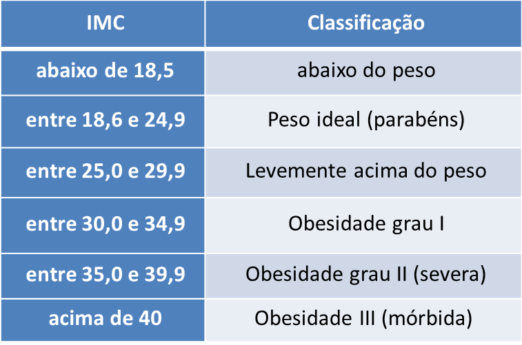

# Exercício 2 Fábrica de Programador - Calculadora de IMC

Crie uma calculadora ,utilizando HTML, CSS e JavaScript. A calculadora deve calcular o IMC de uma pessoa, dado seu peso (em kg) e sua altura (em metros). Crie dois campos (​inputs​) para receber as entradas do usuário. Crie também um botão para realizar a chamada de função que calculará o IMC.

Ao clicar no botão a função de cálculo de IMC deve ser chamada. Ao final do algoritmo de calculo, deve ser exibido o resultado para o usuário. A conclusão do IMC é dado em intervalos de valores. Segue abaixo a tabela com os intervalos do IMC:

